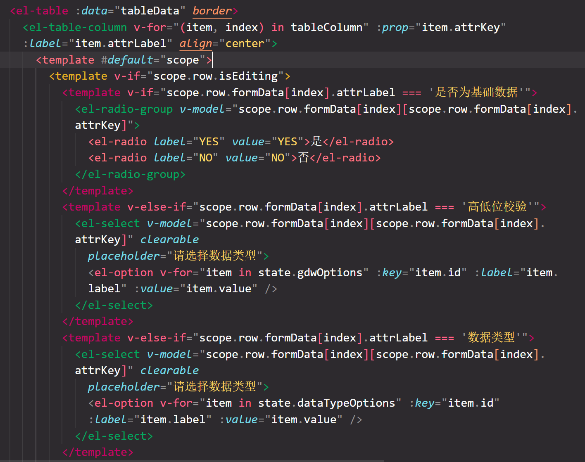

## 动环项目遇到的问题

### 1.ELEMENT-PLUS 的主题样式覆盖问题

> **ELEMENT-PLUS 源码图** 

> 解决方案：

    我们需要手动配置需要覆盖样式的变量，并在 项目的入口文件引入我们自定义的变量文件。

```ts
// main.ts
// import "element-plus/dist/index.css";
import "@/style/element/variarbles.scss";
// 导入公共样式
import "@/style/index.scss";
```

```scss
// variable.scss

该文件必须创建在项目的src/style/element文件夹下，并引入到 main.ts 文件中。
@forward "element-plus/theme-chalk/src/common/var.scss" with (
  //下面是自定义配置颜色列表
  $colors: (
    "primary": (
      "base": #2e5cf6,
    ),
    "success": (
      "base": #3ccb7f,
    ),
    "info": (
      "base": #a3a3a3,
    ),
    "warning": (
      "base": #ff692e,
    ),
    "danger": (
      "base": #e62e05,
    ),
  ),
  // $fill-color: (
  //   "": #f0f2f5,
  //   "light": #f5f7fa,
  //   "lighter": #fafafa,
  //   "extra-light": #fafcff,
  //   "dark": #ebedf0,
  //   "darker": #e6e8eb,
  //   "blank": #0e1030,
  // )
);

@use "element-plus/theme-chalk/src/index.scss" as *;
```

### Element-Plus 表格控制样式修改方式




```js
//这里index和row即为插槽循环的索引和数据
const handleEdit = (index, row) => {
  //数据没有isEditing手动往row对象里添加。
  row.isEditing = true;
  console.log(index, row);
};
```

### 有关 axios 文件下载请求的配置

<details>
  <summary>
  <span >点击展开</span>
  </summary>

```ts
//http.ts
import Axios, {
  AxiosInstance,
  AxiosRequestConfig,
  AxiosResponse,
  CustomParamsSerializer,
} from "axios";
import { stringify } from "qs";
import { ElMessage, ElMessageBox } from "element-plus";
import { getToken } from "@/utils/auth";

import { PureHttpRequestConfig, RequestMethods } from "./types.d";
import { ResultType } from "@/api/types";
import { useUserStore } from "@/store/modules/user";
import { router } from "@/router";

const defaultConfig: AxiosRequestConfig = {
  // 请求超时时间
  timeout: 30000,
  baseURL: import.meta.env.VITE_BASE_URL,
  headers: {},
  paramsSerializer: {
    serialize: stringify as unknown as CustomParamsSerializer,
  },
};

class Http {
  constructor() {
    this.httpInterceptorsRequest();
    this.httpInterceptorsResponse();
  }

  /** 初始化配置对象 */
  private static initConfig: PureHttpRequestConfig = {};

  /** 保存当前Axios实例对象 */
  private static axiosInstance: AxiosInstance = Axios.create(defaultConfig);

  /** 请求拦截 */
  private httpInterceptorsRequest(): void {
    Http.axiosInstance.interceptors.request.use(
      async (config: any) => {
        if (typeof config.beforeRequestCallback === "function") {
          config.beforeRequestCallback(config);
          return config;
        }
        if (Http.initConfig.beforeRequestCallback) {
          Http.initConfig.beforeRequestCallback(config);
          return config;
        }
        return new Promise((resolve) => {
          const data: any = getToken();
          if (data) {
            config.headers["Authorization"] = data.token;
          }
          resolve(config);
        });
      },
      (error) => {
        return Promise.reject(error);
      }
    );
  }

  /** 响应拦截 */
  private httpInterceptorsResponse(): void {
    const instance = Http.axiosInstance;
    instance.interceptors.response.use(
      (response) => {
        const $config = response.config as PureHttpRequestConfig;
        if (typeof $config.beforeResponseCallback === "function") {
          $config.beforeResponseCallback(response);
          return response;
        }
        if (Http.initConfig.beforeResponseCallback) {
          Http.initConfig.beforeResponseCallback(response);
          return response;
        }
        return response;
      },
      (error: AxiosResponse) => {
        return Promise.reject(error);
      }
    );
  }

  /** 通用请求函数 */
  public request<T>(
    method: RequestMethods,
    url: string,
    param?: AxiosRequestConfig,
    axiosConfig?: PureHttpRequestConfig
  ): Promise<T> {
    const config = {
      method,
      url,
      ...param,
      ...axiosConfig,
    } as PureHttpRequestConfig;
    // 单独处理自定义请求/响应回掉
    return new Promise((resolve, reject) => {
      console.log(config);

      Http.axiosInstance
        .request(config)
        .then((response: AxiosResponse<ResultType>) => {
          if (config.params) {
            console.log("走着了");

            const data = response.data as unknown as Blob;
            resolve(data as any);
            return;
          }
          const { code, data, msg } = response.data;
          if (!code) {
            console.log(response.data);

            resolve(response.data as any);
            return;
          }
          switch (code) {
            case 200:
              console.log(data);

              resolve(data);
              break;
            case 5001:
              ElMessageBox.close();
              ElMessageBox.confirm(
                "登录已过期或登录信息不存在，请重新登录",
                "提示",
                {
                  confirmButtonText: "重新登录",
                  cancelButtonText: "取消",
                  type: "warning",
                }
              )
                .then(async () => {
                  await useUserStore().clear();
                  await router.push({
                    path: "/login",
                    query: {
                      redirect: router.currentRoute.value.fullPath,
                    },
                  });
                })
                .catch(() => {});
              break;
            default:
              ElMessage.error(msg || "网络错误");
              reject(response);
          }
        })
        .catch((error) => {
          reject(error);
        });
    });
  }

  /** 单独抽离的post工具函数 */
  public post<P>(
    url: string,
    data?: Record<string, any>,
    config?: PureHttpRequestConfig
  ): Promise<P> {
    return this.request<P>("post", url, { data }, config);
  }

  /** 单独抽离的get工具函数 */
  public get<P>(
    url: string,
    params?: Record<string, any>,
    config?: PureHttpRequestConfig
  ): Promise<P> {
    return this.request<P>("get", url, { params }, config);
  }

  public blobGet<P>(url: string, params?: Record<string, any>): Promise<P> {
    return this.request<P>("get", url, { ...params });
  }
}

export const http = new Http();
```

</details>

```js
  //关于这两个封装的方法，本质上第一个get是更通用的方法，里面的params是用来传入一些url拼接的参数，而第二种方法是专门用来下载文件的。是因为要设置响应类型为blob类型，这样在调用接口以后拿到的res即为文件流，可以直接下载到本地。
   /** 单独抽离的get工具函数 */
    public get<P>(
        url: string,
        params?: Record<string, any>,
        config?: PureHttpRequestConfig
    ): Promise<P> {
        return this.request<P>("get", url, {params}, config);
    }

    public blobGet<P>(
        url: string,
        params?: Record<string, any>,
    ): Promise<P> {
        return this.request<P>("get", url, {...params});
    }
```

### vue3 的一个坑

> 问题描述

> 在实现 vue 单页面时，使用路由跳转到 A、B 和 C 页面。
> 这是在 vue3 中遇到的问题，当进入 A 页面后，再点击菜单进入 B 或 C 页面时，面包屑导航正常显示，但是页面没有渲染出来；
> 在没有进入 A 页面之前，B 和 C 页面之间相互跳转没有问题。
> 只要进入 A 页面后，路由跳转到其他页面就不会被渲染，再从其他页面跳转到 A 页面也不会被渲染。

```vue
//a.vue
<template>
  <div>A页面标题</div>
  <div>A页面内容</div>
</template>
```

```vue
//b.vue
<template>
  <div>
    <div>B页面标题</div>
    <div>B页面内容</div>
  </div>
</template>
```

```vue
//b.vue
<template>
  <div>
    <div>C页面标题</div>
    <div>C页面内容</div>
  </div>
</template>
```
