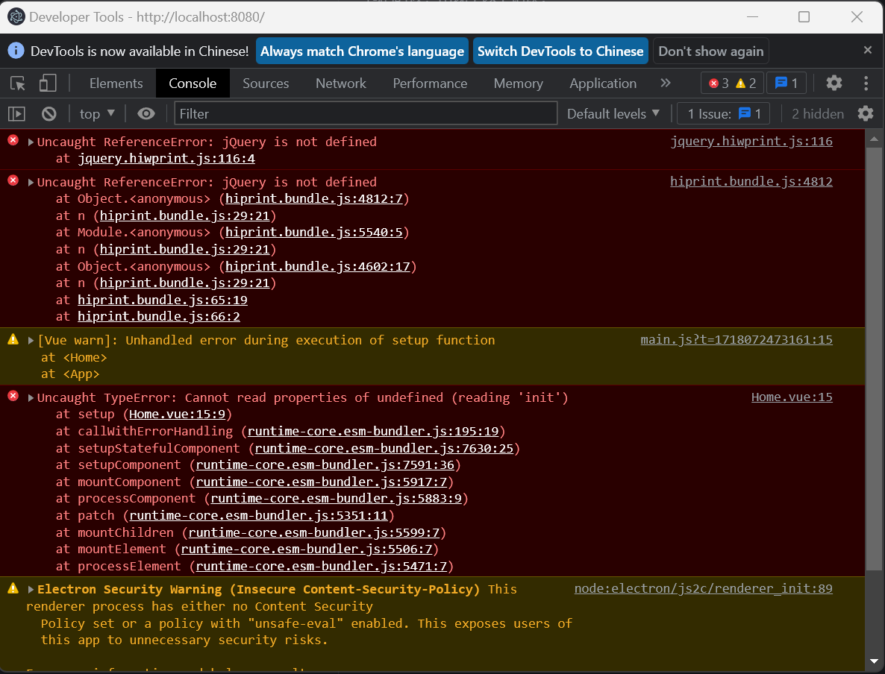

## 1. 使用 vite 打包过后，在使用 electron 打包的时候，出现了以下错误：



### 解决方案

需要在 script 标签前后添加判断

```js
//  在脚本导入之前插入此行
<script>if (typeof module === 'object') {window.module = module; module = undefined;}</script>

//  导入要用到的js脚本
<script src="scripts/jquery.min.js"></script>
<script src="scripts/vendor.js"></script>

//  在脚本导入之后插入此行
<script>if (window.module) module = window.module;</script>
```

## 2. vite 配合 ts 使用一定要装的插件

- vite-plugin-checker：检查代码规范

<!-- vite-plgin-checker插件的用法 -->

```bash
npm i -D vite-plugin-checker
```

```js
// vite.config.js
import checker from "vite-plugin-checker";
export default defineConfig({
  plugins: [
    checker({
      typescript: true, // enable type-checking with TypeScript
      eslint: {
        enabled: true, // enable linting with ESLint
        severity: "error", // set the linting severity level
        rules: {
          // custom rules
        },
      },
    }),
  ],
});
```

- 正常 vite 打包的时候会编译 ts 文件，但不会检查代码类型。
- 如果需要打包的时候发现类型错误阻止打包需要在 package.json 中添加以下配置：

```json
// package.json
"scripts": {
    "build": "tsc --noEmit && vite build"
}
```

> 默认工程内部如果有 ts 文件，需要创建 tsconfig.json 文件，并可以配置一些对应的检查手段和规则。

```json
// tsconfig.json
{
  "compilerOptions": {
    "moduleResolution": "node", // 指定模块解析策略，设置为 node 则可以识别 node_modules 目录 如果在 import {} from "lodash" 会报错是因为没有相对路径和绝对路径，增加该配置项则表明引入模块按照node环境解析。
    "skipLibCheck": true // 是否跳过检查node_modules目录的检查
    "module": "esNext", // 指定模块的生成方式，设置为 esnext 可以更好的兼容浏览器,默认es 3
  }
}
```

> 三斜线指令是 TypeScript 中的一种特殊注释语法，用于提供编译器指令。它们的语法是三个斜线后跟一个 XML 标签，通常用于引用外部声明文件（.d.ts 文件）。

```ts
// vite-env.d.ts

/// <reference path="path/to/file.d.ts" />
//这个指令告诉编译器引用指定的声明文件，以便在编译时包含这些类型信息。
/// <reference types="vite/client" />
//这个指令告诉编译器引用一个类型库，例如Node.js的类型定义。这在使用不同的环境（如Node.js或浏览器）时非常有用。
```

## js 写循环的时候一些小的优化

> 防抖，节流不要使用自己写的函数，使用 lodash 库的函数

```js
//比如foreach循环，原生的foreach循环会导致频繁的DOM操作，影响性能，可以使用lodash的forEach函数
_.forEach(arr, function (item) {
  console.log(item);
});
```

> 循环，不要使用数组.length，应该在 for 循环定义变量 i 的时候增加一个 len 值来记录数组的长度，这样可以避免每次循环的时候都要找父亲要一下数组的长度，提高性能。

```js
// 原生的for循环
for (var i = 0; i < arr.length; i++) {
  console.log(arr[i]);
}

// 使用变量len记录数组的长度
for (var i = 0，len = arr.length;; i < len; i++) {
  console.log(arr[i]);
}
```

> 数组的遍历，不要使用 forEach，map，filter 等方法，这些方法都会创建新的数组，会导致性能问题。

```js
// 原生的forEach方法
arr.forEach(function (item) {
  console.log(item);
});

// 使用for循环遍历
for (var i = 0; i < arr.length; i++) {
  console.log(arr[i]);
}
```

> 数组的遍历，不要使用 for in 循环，因为 for in 循环会遍历对象原型链上的属性，会导致性能问题。

```js
// 原生的for in循环
for (var key in obj) {
  console.log(key);
}

// 使用Object.keys方法遍历
var keys = Object.keys(obj);
for (var i = 0; i < keys.length; i++) {
  var key = keys[i];
  console.log(key);
}
```
