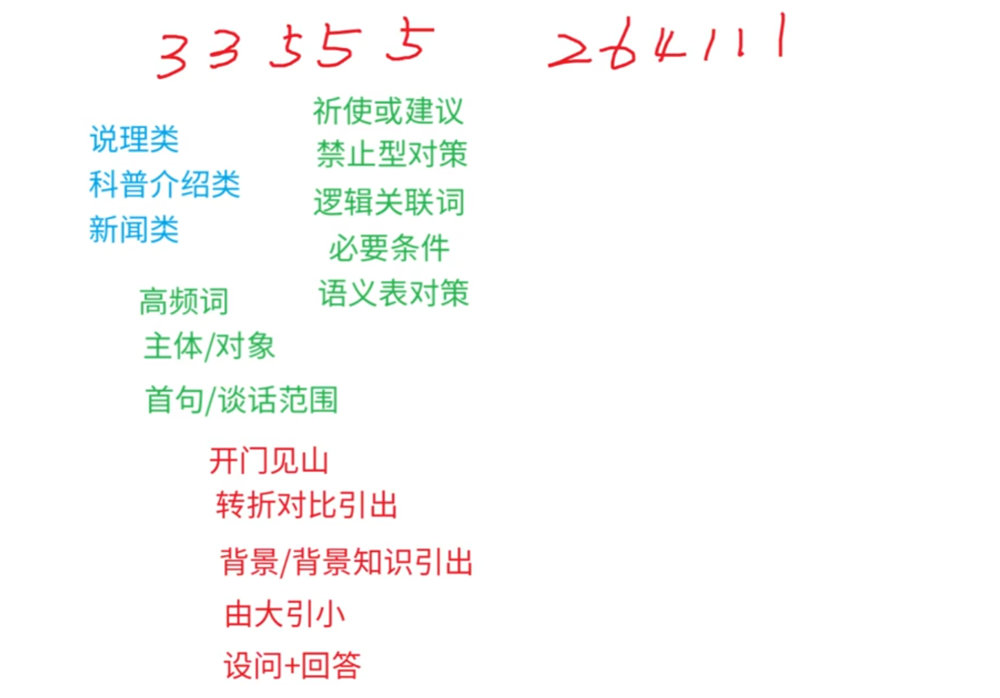

## 初识公专

刑罚：{
主刑：{
管制，拘役，有期徒刑，无期徒刑，死刑
}
附加刑：{
罚金，没收财产，剥夺政治权利 ，驱逐出境。
}
}

公安机关执行：{
法院：{
钱， 要命，放人。
}
监狱：{
长期时间的。
}
公安：{
短期：{
拘役（1-6-1），不足 3 个月
}
特有的：{
剥夺政治权利，驱逐出境。
}
}
司法局：{
社区矫正：{
积压，管制，缓刑，假释。
}
}
}

谣言：{ 1.了解情况 2.及时客观公开 3.责令删除 4.惩处谣言制造者。 5.法制宣传
6.……
}

## 端正三观

职业素养
职业素养主要测查报考者的<mark>政治素质、职业道德修养和职业纪律养成</mark>情况。 
1. 政治素质
 
    (1)政治立场与忠诚度

    (2)政治敏锐性与鉴别询 
2. 职业道德和纪律要求

    (1)人民警察核心价值观

    (2)人民警察职业道德

    (3)人民警察职业纪律

人民警察职业道德规范

## 行测口诀

### 图推
1. 屈臣式整风（曲直性、对称性、相似性、整体与部分、封闭性）
2. 点线面角素（连接点或点数、线的数量、面的数量、角度的数量、元素的种类）
3. 直接想位移（垂直平行、连接方式点连接还是线连接、方向对称轴方向端点方向、位置、移动）
    3.1 其它规律（叠加、元素换算、遍历各类元素均出现相同次数或均出现在不同位置。）
4. 四大类和六提示
    四大类（背景图）：三大哥和六小弟
    三大哥（移动、叠加、部份数）
    六小弟（笔（笔画数）、面 面积 连 连接方式（无连接 点连接 线连接）、报 报团、对 对称（轴对称移动等等）、滴 递推（所有图形每行（列）均有阴影且相邻图形相似。））

    四大类（对称图）：三大哥和两小弟
    三大哥（性质 对称轴的性质（不对称 轴对称 中心对称 或者 一个轴一个中心）、数量 对称轴数量、方向 对称轴方向）
    两小弟（过点过线过面和位置关系）

    可能也会用到元素换算。

图推之立体图形：

    六面体类： 

## 数量关系

和差倍比与方程法：倍数特性 比如 6x+5y  = 36  6x是6的倍数，36也是6的倍数所以5y也必须是6的倍数，即y必须是6的倍数

分数比可以找其中的一个还原回去然后在根据题目求出份数差比如原来是3：8：4，变成了5：4：3：找到月份的分数比8和4把后面比例还原扩大二倍即10：8：6  10和3差了7份，又因为增加了14个变为了第二次的比例所以该7份=14，得出1份是2.

### 工程问题

    已知条件为工作时间：
    公式：工作总量=时间*效率。先找工作总量在找效率。

    已知条件为效率比例：
    直接把效率比当作效率。

倍数关系就设是后面的效率为1，前面的效率为x

    比例法运用：
    效率之比和时间之比成反比。

### 余数、平方数与等差数列

    平方数问题：

    
    余数问题：

### 整除问题和合作完工问题

    利用整除特性解决纯整除问题

    合作完工问题的整体思想

### 容斥问题

    1.公式:

    
    2.最值问题:容斥+最值(尽可能让其中一个不确定的变量大)

    
    3.画图解决

### 溶液问题和十字交叉法

    1.溶液问题

    
    2.十字交叉法
    典型题目:已知3A求C之比,题目求谁把谁当分母.

### 经济利润问题

    1.涉及到的概念: 成本+利润=售价
    单个利润/单个售价/单个成本*销量 = 总利润/收入/成本
    N折 =  0.N*定价
    利润率 成本利润率= 利润/成本(数量用的多) 收入利润率 = 利润/收入(资料分析用的多)

    2.分批销售
    多利用收入列方程,多"问什么设什么"
    第一部分的收入+第二部分的收入 = 总收入

### 经济利润之函数最值、增长相关
    
    1. 函数最值
    利用函数的性质求解最值
    2. 增长率相关
    要用到十字交叉或者比值增长率公式
    R=(R1-R2)/(1+R2)

### 和定最值与最不利极限题

    1.和定最值
    问谁把谁设成X,其它用x+1、x-1;
    问最多,其它的尽量小,问最少,其它的尽量大
    例题:

    
    2.最不利极限题

### 周期循环与日期星期问题

    1.周期循环
    一般考察的是两个循环在哪一天会出现相同的东西,考察最小公倍数.

    
    2.日期星期问题
    记住星期7天为一周期,利用30的性质大致计算最后在补天数差.

    3.利用"唯一性"确定星期日期

### 平面几何问题

    1.平面几何之三角形:特殊直角三角形、勾股定理、特殊勾股数、相似三角形、等底等高等
    两个相似的图形,边长比为1:n,面积比是1:n^2,体积比是1:n^3.
    2.平面几何之其它：圆形、扇形、正方形长方形等。

### 立体几何与特殊几何问题

    1.立体几何表面积
    2.立体几何体积
    3.等比放缩 边长比为1:n,面积比是1:n^2,体积比是1:n^3.

    
    4.几何最值：
    周长一定，正方形面积最大。面积一定，周长最短。
    面积一定 越接近球体积越大。体积一定 越接近于球，面积越小.
    5.最短路径

### 基础排列组合（基础不好可以放）

    1.基础排列：有序为排列，无序为组合;分类用加法，分步用乘法;从特殊入手，全部减不符
               无序为组合有序为排列。
               分类用加法，分步用乘法.从特殊入手，全部减不符(看到至少或者不能字眼的时候要考虑并非一定使用该方法)。
               例题：
