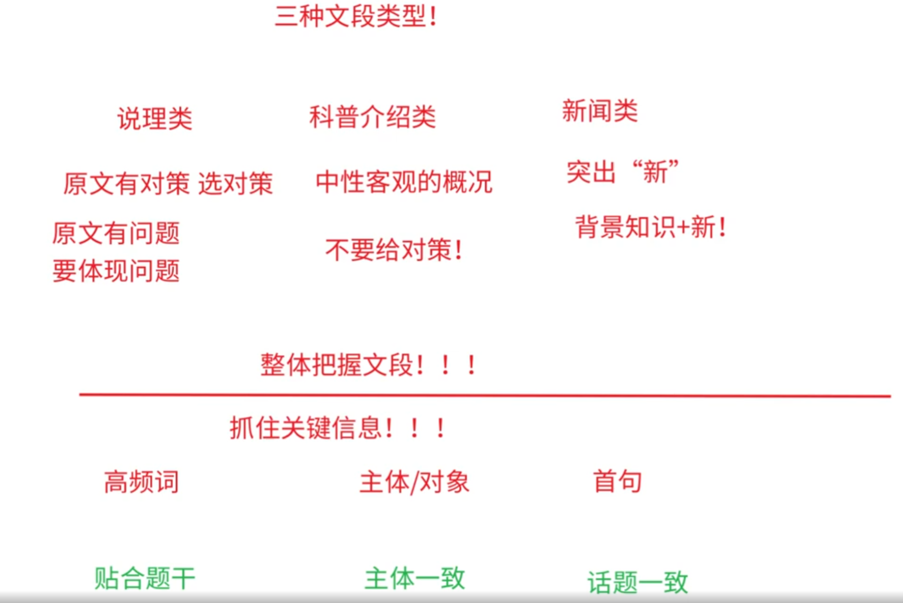
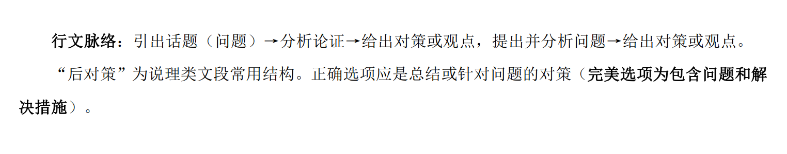
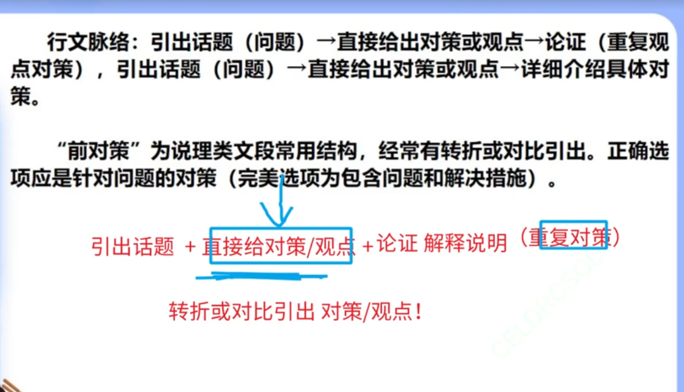

## 三类文段解题原则： 

### 说理类文章

    原文有对策优先选对策，原文有作者观点或态度选观点态度，原文有问题要体现问题（可
    概括问题也可解决问题）

### 科普类文章

    选“中性、客观”的概括选项，此时反而不选对策；

### 新闻类文章

    重视新状况、新成绩、新突破等“新”。

### 方法

## 中心理解题目之抓住关键信息

### 关键信息之高频词

### 关键信息之主体

### 引出话题的五种方式

    1.开门见山
    首句即指明谈论重点，需注意首句中的关键信息（谈论的是“谁”的“什么事”）。
    2.转折对比引出
    “前对策”结构经常用转折或对比引出话题，常直接引出问题、观点、对策等。
    3.背景/背景知识引出
    背景或背景知识都不重要，介绍背景或背景知识是为下文服务。
    4.由大引小
    由“谈论对象的上级集合”引出“特定的谈论对象”，切记此时谈论对象并非例子。
    5.设问引出
    由问题引出，注意下文是否为对此问题的回答，若是，需重点注意该问题的答案。

## 口诀

    33555 264111

## 心理解题目之结构分析

### 五种常见对策表达方式

#### 五种结构之“后对策”

#### 五种结构之“前对策”

#### 五种结构之总分与分总

    总分
    行文脉络：总概况→分论点展开，总观点→分析。总概括、总观点更重要。
    分总
    行文脉络：分析介绍→总结。总结的提示词有“这些”、“因此”等。